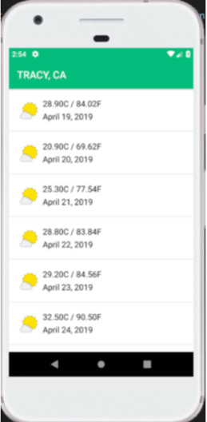

# nn-challenge

## Multiplatform temperature forecast

Please write a temperature forecast .NET app (native) for Android and iOS devices, using the given template. Please do not use Xamarin Forms or .NET MAUI Multiplatform. 

If you don’t have access to a Mac to compile for iOS, you can skip iOS. However, we prefer to see submissions with both platforms.

In the template, you have already a view with city selection for both mobile platforms. The button under the city selection will lead you to the next view, which is the challenge:

Please finish the app by editing the remaining views: ForecastActivity (Android) and ForecastViewController (iOS) to show weather information for the selected city in the next 3 days. 

Please show the forecast in a list (layout preview included) for every hour.

To display weather data, both views should use the IWeatherForcastVO interface.

Please use as much platform independent code as possible to avoid code duplication for both Android and iOS platforms. 

To get real forecast data for selected city in 3 upcoming days, please use the following endpoint:

https://api.weatherapi.com/v1/forecast.json?key=898147f83a734b7dbaa95705211612&q=Berlin&days=3&aqi=no&alerts=no

There, you can exchange “Berlin” with a selected city from the list.

## Example screen for a UI 

(note that you’ll need to add the hours in your implementation to show the weather for every hour).

## Delivery

When you’re done, but latest 24h after starting the challenge, please submit by replying to the email you have received and:
adding a link to download your file (no email attachment)
Note: Must be a permanent link, no WeTransfer or other services with links that expire after a few days.
adding proof for the academic background you have listed in the application (i.e. if exists: certificate for academic degree, with final grade visible)

Happy coding! :)
